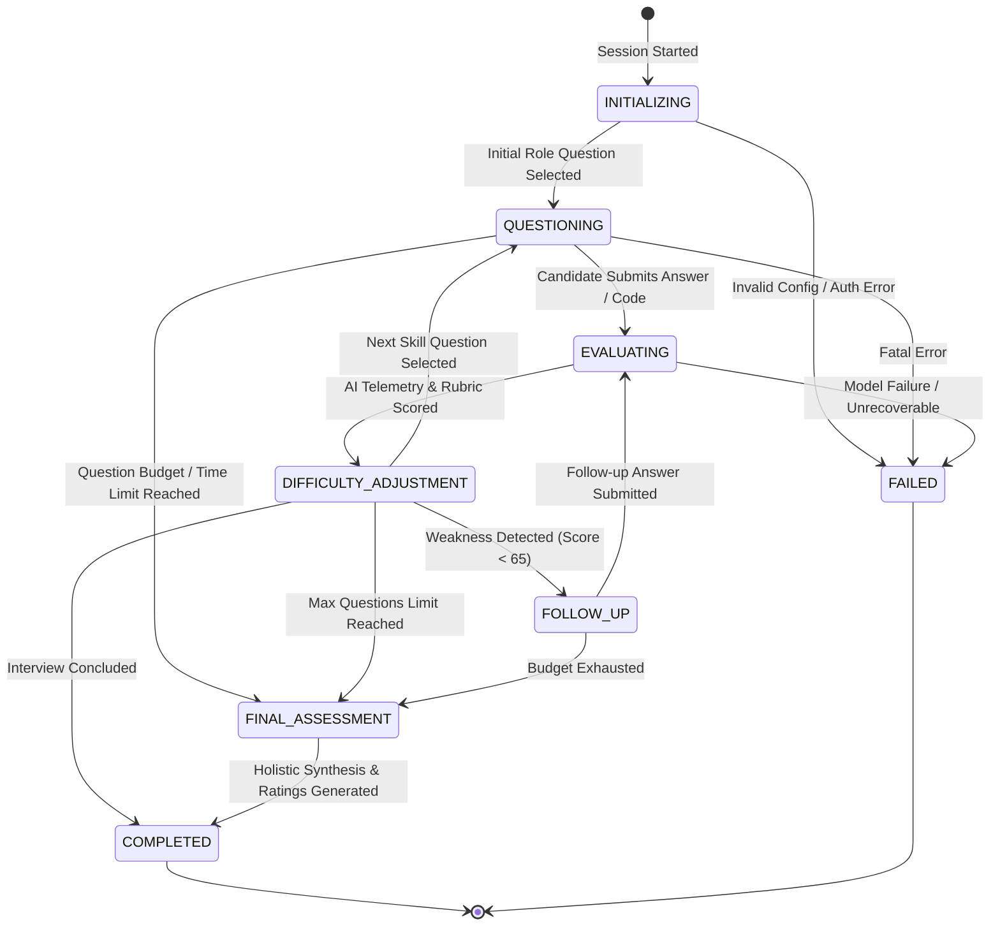
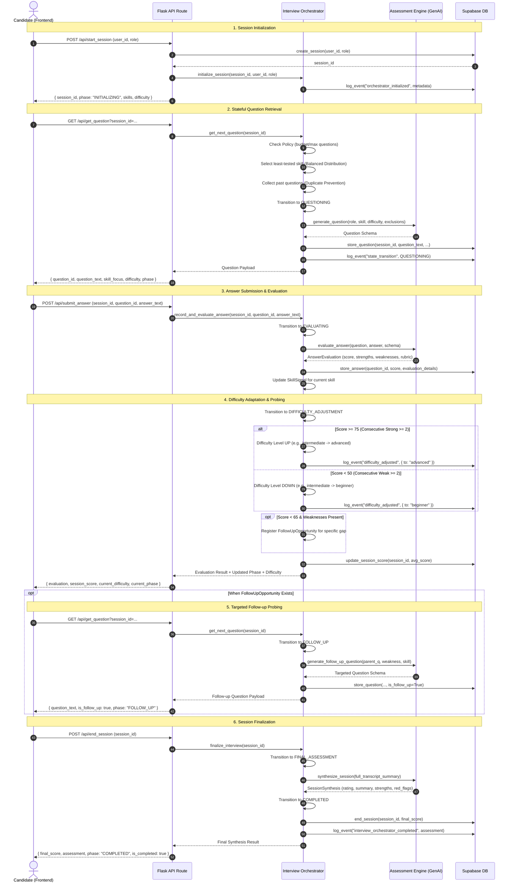

# Interview Orchestrator & State Machine

## 1. Overview
The **Interview Orchestrator** transforms the application from independent question generation into a **stateful, adaptive, backend-authoritative assessment engine**.

The backend serves as the single source of truth for:
- State Machine Phase (`INITIALIZING`, `QUESTIONING`, `EVALUATING`, `FOLLOW_UP`, `DIFFICULTY_ADJUSTMENT`, `FINAL_ASSESSMENT`, `COMPLETED`, `FAILED`)
- Adaptive Difficulty (`beginner`, `intermediate`, `advanced`)
- Target Role & Competency Matrix
- Current Skill Focus & Balanced Skill Coverage
- Question History & Duplicate Prevention
- Candidate Performance & Skill Signal Tracking
- Targeted Weakness Probing via Structured Follow-ups
- Session Policy & Time Budget Enforcement

---

## 2. Interview State Machine

---

## 3. Sequence Diagram: Stateful Adaptive Loop

The diagram below details the end-to-end communication flow between the Frontend, the Flask API Routes, the `InterviewOrchestrator`, the `AssessmentEngine` (Google GenAI), and the `Supabase` database:

---

## 4. Key Orchestration Algorithms

### 4.1 Balanced Skill Distribution
For each target role, the orchestrator tracks a `SkillSignal` per competency:
- `Software Engineer`: Data Structures & Algorithms, System Architecture, API Design, Concurrency, Testing & Reliability.
- `Data Scientist`: Statistics, Machine Learning, Data Pipelines/SQL, Feature Engineering, Evaluation & Ethics.
- `Product Manager`: Strategy, Metrics & Experimentation, User Empathy, Prioritization, Technical Communication.
- `DevOps Engineer`: CI/CD, Containerization/Kubernetes, Infrastructure as Code, Observability, Cloud Security.

**Selection Rule**:
The next skill focus is selected using `min(skills_distribution.values(), key=lambda s: (s.questions_count, len(s.scores)))`. This guarantees that questions cycle evenly through the curriculum rather than repeatedly testing the same domain.

### 4.2 Adaptive Difficulty Engine
Difficulty is modeled across three levels: `beginner` <-> `intermediate` <-> `advanced`.
- Initial state is set to `intermediate`.
- Two consecutive answers with `score >= 75` elevate difficulty to `advanced`.
- Two consecutive answers with `score < 50` lower difficulty to `beginner`.
- Any middle score (50–74) resets the consecutive streak, preventing oscillation.
- Difficulty adjustments are strictly bounded: upper bound at `advanced`, lower bound at `beginner`.

### 4.3 Duplicate Question Prevention
Duplicate questions degrade candidate experience and distort assessments.
1. The orchestrator maintains an authoritative history of question texts (`questions_asked`).
2. When requesting questions from the model, the previous question texts are injected into the negative constraint rubric.
3. Before storing any question, the normalized alphanumeric representation is compared against all previously asked questions.
4. If a near-identical question is produced, the orchestrator rejects it and generates an alternative scenario.

### 4.4 Targeted Follow-ups vs. Generic Follow-ups
Unlike generic prompts ("Can you elaborate?"), the orchestrator tracks candidate weaknesses:
- When a candidate scores `< 65` on a question, the top weakness (e.g., "Failed to explain lock contention") is extracted.
- A `FollowUpOpportunity` is queued targeting that specific flaw.
- The follow-up question specifically probes the edge case, tradeoff, or failure scenario where the candidate faltered.

### 4.5 Backend Authoritative State
- State is managed and stored in backend memory with full reconstitution capability from the Supabase `sessions`, `questions`, and `logs` tables.
- Frontend clients query `/api/session/<session_id>/state` to retrieve current phase, skill progress, and metrics.
- All state transitions persist structured audit records in the Supabase `logs` table with event type `state_transition`.
