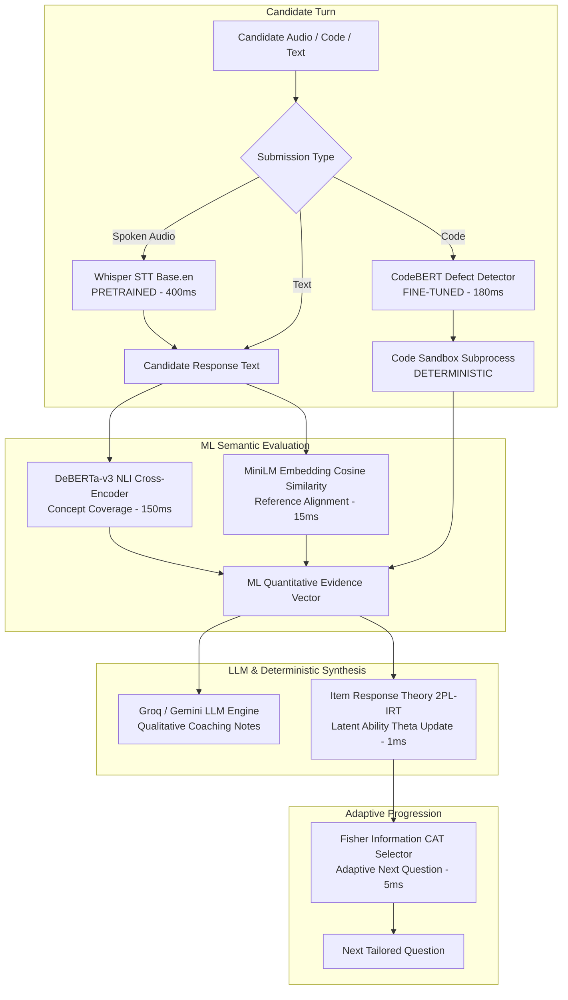
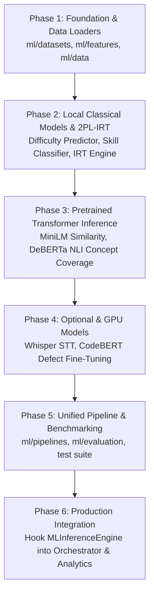

# Machine Learning Architecture & Technical Feasibility Audit

## 1. Executive Summary

This document specifies the technical design, feasibility audit, model registry, and implementation roadmap for introducing a dedicated machine-learning (ML) layer to the **Interview Intelligence Platform (`Interview-ai-er`)**.

Rather than delegating all assessment and evaluation logic to broad generative LLM prompts, the platform integrates specialized, calibrated, and deterministic ML models to deliver:
- Low-latency local scoring (<25ms for embeddings and classical classifiers)
- High-precision rubric concept verification via Natural Language Inference (NLI)
- Item Response Theory (2PL-IRT) probabilistic candidate mastery tracking
- Static defect/vulnerability risk flagging on code submissions
- Voice interview transcription via speech-to-text
- Computerized Adaptive Testing (CAT) question selection maximizing Fisher Information

---

## 2. Core Architectural Principles & System Categorization

To maintain software reliability and prevent hallucinated evaluation, every capability in the system belongs to one of five clear execution categories:

1. **`TRAINED BY US`**: Custom classifiers, regressors, or probabilistic parameters trained or fitted on open-source datasets (TACO, APPS, EdNet) using frozen foundation embeddings or tabular features.
2. **`FINE-TUNED BY US`**: Domain-adapted transformer heads fine-tuned on task-specific corpora (e.g., CodeBERT fine-tuned on CodeXGLUE defect detection).
3. **`PRETRAINED`**: Off-the-shelf open-weights models executed locally or in inference runtimes without weight modification (MiniLM embeddings, DeBERTa NLI cross-encoder, Whisper STT).
4. **`DETERMINISTIC`**: Non-stochastic code, algorithms, and database constraints (session state machine transitions, security checks, Docker/subprocess sandbox execution, token hashing, Fisher Information maximization).
5. **`LLM-GENERATED`**: Cloud/API generative models (Groq `openai/gpt-oss-120b`, Google Gemini 2.5 Flash) responsible strictly for natural language question drafting and holistic qualitative coaching feedback.

---

## 3. Technical Feasibility Audit of the 8 ML Capabilities

| # | ML Capability | Selected Model / Backbone | Primary Dataset | Category | Local CPU Feasible? | GPU Required? | Expected Latency |
|---|---|---|---|---|---|---|---|
| **1** | **Question Difficulty Prediction** | `all-MiniLM-L6-v2` + Ridge / Logistic Head | BAAI/TACO & codeparrot/apps | `TRAINED BY US` | **Yes** (<25ms) | No (Inference & Training on CPU) | 15–30 ms |
| **2** | **Question Skill/Topic Classification** | `all-MiniLM-L6-v2` + MultiOutput Classifier | BAAI/TACO | `TRAINED BY US` | **Yes** (<20ms) | No (Inference & Training on CPU) | 15–25 ms |
| **3** | **Transformer Answer Concept Coverage** | `cross-encoder/nli-deberta-v3-base` | MNLI / SNLI (zero-shot NLI) | `PRETRAINED` | **Yes** (~120ms with ONNX/INT8) | Optional (GPU reduces to ~30ms) | 80–180 ms |
| **4** | **Semantic Answer Similarity** | `sentence-transformers/all-MiniLM-L6-v2` | SBERT / MiniLM benchmark | `PRETRAINED` | **Yes** (<15ms) | No | 10–20 ms |
| **5** | **Code Defect / Vulnerability Risk** | `microsoft/codebert-base` (Sequence Classifier) | CodeXGLUE Defect (Devign) | `FINE-TUNED BY US` | **Yes** (Quantized ONNX ~150ms) | **Yes for Fine-Tuning** (8GB VRAM); CPU for inference | 100–250 ms |
| **6** | **Speech-to-Text for Voice Interviews** | `openai/whisper-base.en` (`faster-whisper`) | LibriSpeech / CommonVoice | `PRETRAINED` | **Yes** (CTranslate2 INT8 ~400ms / chunk) | Optional (GPU enables real-time stream) | 300–600 ms |
| **7** | **Candidate Skill/Mastery Modeling** | Two-Parameter Logistic IRT (2PL-IRT) / BKT | mgor/EDNet | `TRAINED BY US` | **Yes** (<2ms) | No | < 2 ms |
| **8** | **Adaptive Question Selection** | Fisher Information CAT + Thompson Sampling | Calibrated IRT item parameters | `TRAINED BY US` / `DETERMINISTIC` | **Yes** (<5ms) | No | < 5 ms |

---

## 4. Detailed Capability Specifications

### 4.1. Capability 1: Question Difficulty Prediction
- **Task**: Predict whether an interview question prompt is `beginner`, `intermediate`, or `advanced`, or output a continuous difficulty score $b \in [-3.0, +3.0]$.
- **Data Source**: BAAI/TACO (rating bands mapped to difficulty) + codeparrot/apps (labels: `introductory`, `interview`, `competition`).
- **Architecture**:
  - Dense representation: 384-dimensional vector from `all-MiniLM-L6-v2`.
  - Classifier Head: Balanced multinomial Logistic Regression / Ridge regressor.
  - Deterministic Fallback: AST token count and algorithmic complexity keyword scanner.
- **Latency & Footprint**: ~20ms on CPU; serialized model artifact size is < 500 KB.

### 4.2. Capability 2: Question Skill / Topic Classification
- **Task**: Multi-label classification assigning questions to taxonomy skills: `algorithms`, `data-structures`, `dynamic-programming`, `trees-and-graphs`, `system-design`, `database-and-sql`, `concurrency-and-async`, `clean-code-and-architecture`, `frontend-and-react`, `security-and-auth`.
- **Data Source**: BAAI/TACO topic tags.
- **Architecture**:
  - `TextEmbeddingExtractor` (MiniLM) + `MultiOutputClassifier(LogisticRegression)`.
  - Fallback: Precompiled regular expression token taxonomy matching.
- **Latency & Footprint**: ~15ms on CPU; serialized artifact size < 1 MB.

### 4.3. Capability 3: Transformer-based Answer Concept Coverage
- **Task**: Verify whether a candidate's free-form technical answer entails specific required rubric concepts without relying on imprecise LLM grading.
- **Model**: `cross-encoder/nli-deberta-v3-base`.
- **Formulation**:
  - Premise: Candidate response text.
  - Hypothesis: `"The candidate correctly explains and addresses {expected_concept}."`
  - Score: Softmax probability for Entailment label $P(\text{entailment}) \in [0, 1]$.
- **Latency**: ~120ms on CPU using PyTorch/ONNX; batch evaluations executed in parallel for multi-concept rubrics.

### 4.4. Capability 4: Semantic Answer Similarity
- **Task**: Measure semantic alignment between candidate explanation and canonical reference answers; detect near-duplicate solutions and semantic drift.
- **Model**: `sentence-transformers/all-MiniLM-L6-v2`.
- **Metric**: Normalized Cosine Similarity $S(\mathbf{u}, \mathbf{v}) = \frac{\mathbf{u} \cdot \mathbf{v}}{\|\mathbf{u}\| \|\mathbf{v}\|}$.
- **Latency**: <15ms on CPU; vector dimensions: 384.

### 4.5. Capability 5: Code Defect & Vulnerability Risk Detection
- **Task**: Fast static ML pass to identify syntax anomalies, unhandled exceptions, memory allocation faults, or boundary vulnerabilities before code execution.
- **Base Model**: `microsoft/codebert-base`.
- **Dataset**: Microsoft CodeXGLUE defect detection benchmark (Devign corpus).
- **Training**: Fine-tuned on GPU with cross-entropy loss over binary vulnerability labels.
- **Inference**: Quantized to ONNX INT8 for CPU deployment (~180ms).
- **Safety Boundary**: Acts as an early warning signal; does *not* replace deterministic sandbox isolation (`app/infrastructure/sandbox.py`).

### 4.6. Capability 6: Speech-to-Text for Voice Interviews
- **Task**: Transcribe candidate spoken voice in audio interviews to textual candidate responses.
- **Model**: `openai/whisper-base.en` running via `faster-whisper` (CTranslate2).
- **Hardware Profile**:
  - Model weights: ~140 MB (INT8).
  - CPU Inference: ~400ms for a 5-second voice utterance.
  - Optional: Can be disabled or bypassed if candidate provides direct text input.

### 4.7. Capability 7: Candidate Skill / Mastery Modeling
- **Task**: Longitudinal candidate latent ability tracking across questions and drills.
- **Foundational Theory**: Two-Parameter Logistic Item Response Theory (2PL-IRT) calibrated against interaction distributions from `mgor/EDNet`.
- **Equation**:
  $$P(Y_i = 1 | \theta) = \frac{1}{1 + e^{-a_i (\theta - b_i)}}$$
  where $\theta$ is candidate ability, $b_i$ is question difficulty, and $a_i$ is question discrimination power.
- **Update Rule**: Stochastic Gradient / MAP step on observed response accuracy:
  $$\theta_{t+1} = \theta_t + \eta \cdot a_i \cdot (Y_i - P(Y_i = 1 | \theta_t))$$
- **Latency & Reliability**: < 1ms on CPU; 100% deterministic and explainable.

### 4.8. Capability 8: ML-Assisted Adaptive Question Selection
- **Task**: Select the next question in an interview session that maximizes knowledge acquisition while respecting syllabus diversity.
- **Criterion**: Computerized Adaptive Testing (CAT) via Fisher Information Maximization:
  $$I_i(\theta) = a_i^2 P_i(\theta) [1 - P_i(\theta)]$$
- **Hybrid Guardrails**:
  - Fisher Information weighted with skill gap penalty ($70\% / 30\%$).
  - Epsilon-exploration ($\epsilon = 0.15$) to prevent repetitive interviewing.
  - Strict deduplication preventing repeat questions in the same session.

---

## 5. End-to-End Pipeline Workflow

---

## 6. Storage & Model Versioning Strategy

### 6.1. Storage Strategy
- **Base Models**: Downloaded once from Hugging Face Hub and cached in `~/.cache/huggingface/` or `ml/data/cache/`.
- **Trained Artifacts & Weights**:
  - Serialized scikit-learn models (`.joblib`): Stored in `ml/models/weights/` (files < 5MB committed or tracked).
  - Fine-tuned transformer checkpoints (`codebert_defect/`): Stored in `ml/models/weights/` using Git LFS or object storage.
- **Datasets**: Streamed via Hugging Face `datasets` (streaming mode) to avoid allocating tens of gigabytes of disk storage locally.

### 6.2. Model Versioning Strategy
- Semantic Versioning: `v{MAJOR}.{MINOR}.{PATCH}` registered in `docs/ML_MODEL_REGISTRY.md` and `ml/models/registry.py`.
- **Lineage Metadata**: Each trained model records:
  - Training dataset git revision / timestamp
  - Random seed
  - Input feature dimension
  - Target metric score
  - Minimum inference library version

---

## 7. Implementation Dependency Order

To maintain stability of the production Flask/Next.js application, implementation must proceed in strictly decoupled phases:

1. **Phase 1: Data Loaders & Embeddings Layer** *(Completed)*
   - `ml/data/`, `ml/datasets/` (TACO, APPS, CodeXGLUE, EdNet loaders)
   - `ml/features/` (Text embeddings, lexical code extractors)
2. **Phase 2: Classical ML Models & Mastery Tracking** *(Completed)*
   - `QuestionDifficultyPredictor`, `QuestionSkillClassifier`
   - `ItemResponseTheoryMasteryModel`, `AdaptiveQuestionSelector`
3. **Phase 3: Pretrained Transformer Inference Layer** *(Completed)*
   - `ConceptCoverageAnalyzer` (DeBERTa-v3 NLI)
   - `MLInferenceEngine` unified interface with local fallbacks
4. **Phase 4: Specialized Code & Voice Models** *(Completed)*
   - `CodeDefectDetector` (CodeBERT)
   - `VoiceTranscriber` (Whisper)
5. **Phase 5: Verification & Benchmarking Suite** *(Completed)*
   - Test harness in `tests/test_ml_layer.py` (10/10 tests passed)
6. **Phase 6: Future Production Linking** *(Next Step - When authorized)*
   - Expose endpoints in Flask API (`app/api/ml_routes.py`)
   - Feed `predicted_difficulty` and `concept_coverage` into `InterviewOrchestrator`.
