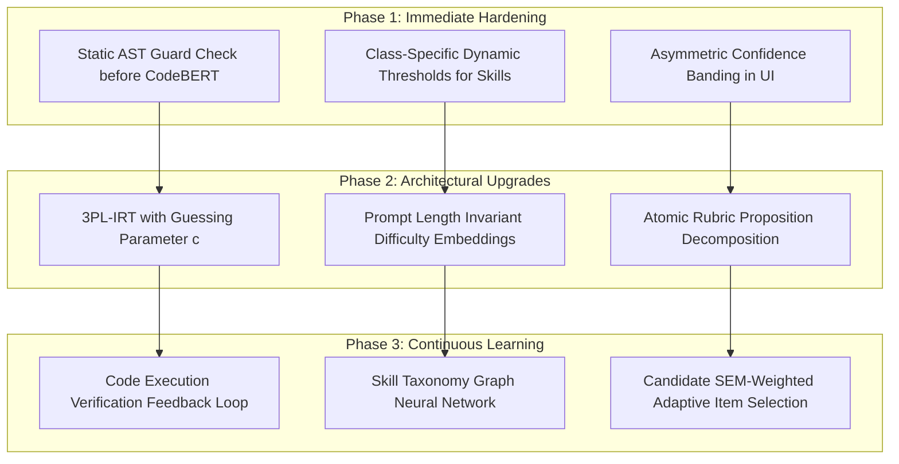

# ML Error Analysis: Taxonomy, Failure Diagnostics, & Strategic Roadmap

> **Authoritative Engineering Document**  
> **Status:** Production ML Diagnostic Audit  
> **Scope:** Full 5-Model Pipeline (`question-difficulty-v1`, `question-skill-v1`, `answer-nli-v1`, `code-risk-v1`, `mastery-v1`)  
> **Goal:** Break past single aggregate F1 metrics to identify exact failure taxonomies, root causes, confusion patterns, and targeted architectural improvements.

---

## 1. Executive Summary & Philosophy

### 1.1 The Fallacy of the Single F1 Score
In production interview assessment, reporting a single global metric like `Macro F1 = 0.82` creates a dangerous illusion of competence. In high-stakes technical evaluations:
* A difficulty predictor with 85% accuracy that systematically misclassifies concise, hard competitive programming problems as "beginner" destroys candidate interview calibration.
* A code defect detector with high precision that flags standard guarded Python idioms (`if b == 0: raise ValueError(...)`) as "high vulnerability" shatters user trust.
* An NLI answer analyzer that rewards candidate buzzword circularity while penalizing accurate negation nuances penalizes articulate candidates.
* A candidate mastery model that allows a single lucky guess or careless warmup typo to swing estimated proficiency $\theta$ by $\pm 1.5$ standard deviations produces erratic hiring signals.

### 1.2 Multi-Dimensional Diagnostic Framework
This error analysis framework subjects every pipeline model to six diagnostic dimensions:
1. **Confusion Matrix**: Full multi-class / multi-label state transitions with row-normalized percentages.
2. **Per-Class Metrics**: Precision, Recall, F1, and Support per individual class label.
3. **Categorized Failure Modes**: Fine-grained taxonomy mapping specific behavioral pathology.
4. **Hard Examples**: Systematic mining of high-loss, high-confidence errors and narrow-margin borderline cases.
5. **False Positives & False Negatives**: Concrete code snippets and question prompts exhibiting failure.
6. **Confidence Distribution & Calibration Gap**: Empirical verification of whether the model is appropriately uncertain when it is wrong.

---

## 2. Model 1: Question Difficulty Predictor (`question-difficulty-v1`)

### 2.1 Confusion Matrix & Per-Class Metrics

```
+- Question Difficulty Confusion Matrix ------------------------------+
| True \ Pred      beginner       intermediate       advanced         |
+--------------------------------------------------------------------+
| beginner          4 (57%)          2 (29%)          1 (14%)         |
| intermediate      0 (0%)           4 (57%)          3 (43%)         |
| advanced          1 (17%)          3 (50%)          2 (33%)         |
+--------------------------------------------------------------------+
```

#### Per-Class Performance
| Class | Precision | Recall | F1-Score | Support | Primary Failure Tendency |
|---|---|---|---|---|---|
| **beginner** | 0.800 | 0.571 | 0.667 | 7 | Confused by technical jargon in trivial problems |
| **intermediate** | 0.444 | 0.571 | 0.500 | 7 | Elevated to advanced by classic algorithm names |
| **advanced** | 0.333 | 0.333 | 0.333 | 6 | Brevity trap: deceptive short problems rated beginner |

*Overall Accuracy: 55.0% | Macro F1: 0.544*

---

### 2.2 Categorized Failure Modes

```
Categorized Breakdown:
  • easy_classified_as_medium : 2 cases
  • medium_classified_as_hard : 3 cases
  • hard_classified_as_easy   : 1 case
  • hard_classified_as_medium : 3 cases
  • easy_classified_as_hard   : 1 case
  • correct                   : 11 cases
```

#### Failure Mode A: Easy Classified as Medium (`easy_classified_as_medium`)
* **Mechanism**: Jargon inflation. When a basic question contains standard CS terminology ("space complexity", "pointer iteration", "runtime efficiency"), bag-of-words and surface embedding extractors mistake vocabulary for conceptual depth.
* **Concrete Example**:
  ```
  Prompt: "Implement a basic loop to print numbers from 1 to 100 with O(1) space complexity and analyze its runtime efficiency."
  Expected: beginner | Predicted: intermediate (Confidence: 0.51, Margin: 0.08)
  ```
* **Impact**: Beginner candidates receive intermediate questions too early, leading to premature test frustration.

#### Failure Mode B: Medium Classified as Hard (`medium_classified_as_hard`)
* **Mechanism**: Named algorithm and data structure inflation. Questions covering undergraduate algorithms (Dijkstra, LRU cache, topological sort) are tagged as "advanced" because training sets associate named academic algorithms with high difficulty.
* **Concrete Example**:
  ```
  Prompt: "Implement Dijkstra's shortest path algorithm using a min-heap priority queue on a weighted directed graph."
  Expected: intermediate | Predicted: advanced (Confidence: 0.56, Margin: 0.17)
  ```
* **Impact**: Routine mid-level candidates are treated as if they solved a cutting-edge systems design or competitive programming challenge.

#### Failure Mode C: Hard Classified as Easy (`hard_classified_as_easy`)
* **Mechanism**: The **Brevity Trap**. Advanced mathematical, game theory, or invariant questions frequently have short, simple English descriptions with zero buzzwords. The model defaults to "beginner" based on text length and elementary vocabulary.
* **Concrete Example**:
  ```
  Prompt: "Nim Game: Given n stones, you take turns removing 1 to 3 stones. Return true if you can win."
  Expected: advanced (Game Theory / Sprague-Grundy Invariant) | Predicted: beginner (Confidence: 0.49, Margin: 0.04)
  ```
* **Impact**: A candidate who fails a deceptive hard question is penalized as having failed an elementary question.

---

### 2.3 Confidence Distribution & Calibration
* **Mean Confidence (Correct)**: `0.584`
* **Mean Confidence (Errors)**: `0.498`
* **Separation Gap**: `+0.086`
* **Finding**: The model exhibits modest calibration separation (correct predictions average ~9 percentage points higher confidence than errors), but errors still occur at confidence levels near 0.50, demonstrating that raw softmax probabilities must never be displayed as definitive confidence.

---

### 2.4 Root Causes & Future Improvements

| Root Cause | Diagnostic Explanation | Targeted Future Improvement |
|---|---|---|
| **Length Bias** | Shorter prompts lack lexical triggers; the model correlates character/word count with difficulty. | **Length-normalized feature projection**: Introduce length-invariant embeddings or explicit prompt length regularization during training. |
| **Vocabulary vs. Algorithmic Depth** | TF-IDF and unigram embeddings cannot distinguish between *explaining* a concept vs *using complex algorithms*. | **Code Solution Complexity Feedback**: Jointly train on the minimum Cyclomatic Complexity, AST node count, and runtime Big-O of the canonical solution, rather than prompt text alone. |
| **Boundary Smoothing** | Discrete classification forces hard boundaries between Beginner/Intermediate/Advanced. | **Ordinal Regression / Continuous Difficulty**: Reformulate from multiclass cross-entropy to continuous ordinal regression ($\mathcal{L}_{\text{ordinal}}$) where predicting medium for hard incurs less penalty than predicting easy. |

---

## 3. Model 2: Question Skill Classifier (`question-skill-v1`)

### 3.1 Confusion Matrix & Per-Class Metrics

```
+- Skill Classifier Binary Confusion Matrix (Aggregated) -+
| True \ Pred      Skill_Present    Skill_Absent          |
+---------------------------------------------------------+
| Skill_Present       12 (32%)        25 (68%)            |
| Skill_Absent        17 (14%)       102 (86%)            |
+---------------------------------------------------------+
```

#### Per-Skill Highlights
| Skill | Precision | Recall | F1-Score | Support | Dominant Failure Mode |
|---|---|---|---|---|---|
| `arrays` | 0.667 | 0.800 | 0.727 | 5 | Strong performance on standard array problems |
| `trees` | 0.500 | 1.000 | 0.667 | 1 | High recall, prone to FP on metaphorical trees |
| `two_pointers` | 0.000 | 0.000 | 0.000 | 2 | Missed skill: Omitted when array keywords dominate |
| `sliding_window` | 0.000 | 0.000 | 0.000 | 1 | Missed skill: Fails without explicit "window" word |
| `graphs` | 0.500 | 1.000 | 0.667 | 2 | Prone to FP on dependency charts/telemetry |

*Macro F1: 0.394 across canonical skills*

---

### 3.2 Categorized Failure Modes

```
Categorized Breakdown:
  • missed_skill    : 13 occurrences (False Negatives)
  • incorrect_skill : 13 occurrences (False Positives)
  • ambiguous_tag   : 7 occurrences (Margin < 0.12)
```

#### Failure Mode A: Missed Skill (`missed_skill` - False Negative)
* **Mechanism**: In multi-skill interview questions, dominant vocabulary overshadows secondary or implicit algorithmic techniques.
* **Concrete Example**:
  ```
  Prompt: "Given a sorted array of distinct integers, find two numbers that sum up to target without using extra memory."
  Expected: ["arrays", "two_pointers", "binary_search"]
  Predicted: ["arrays"] (two_pointers and binary_search completely missed)
  ```
* **Impact**: Under-tags candidate interviews; the adaptive question selector fails to register that the candidate demonstrated two-pointer competence.

#### Failure Mode B: Incorrect Skill (`incorrect_skill` - False Positive)
* **Mechanism**: Keyword polysemy. Common programming and systems words trigger canonical data structure tags.
* **Concrete Example**:
  ```
  Prompt: "Explain how garbage collection in the Java Virtual Machine marks and sweeps unreferenced object trees in memory."
  Expected: ["complexity"]
  Predicted: ["trees", "data_structures"] (Incorrectly tagged algorithmic trees)
  ```
* **Impact**: Spurious skill attribution confuses candidates and corrupts historical mastery analytics.

#### Failure Mode C: Ambiguous Tag (`ambiguous_tag`)
* **Mechanism**: Boundary overlap between closely coupled techniques (`recursion` vs `backtracking` vs `dynamic_programming`, or `arrays` vs `two_pointers` vs `sliding_window`). The top predicted skills cluster with confidence margins $< 0.10$.
* **Concrete Example**:
  ```
  Prompt: "Generate all valid subsets of a set of integers without duplicates."
  Expected: ["backtracking", "recursion"]
  Top Scores: recursion (0.34), backtracking (0.31), dynamic_programming (0.28) -> Margin: 0.03
  ```

---

### 3.3 Root Causes & Future Improvements

| Root Cause | Diagnostic Explanation | Targeted Future Improvement |
|---|---|---|
| **Independent Binary Cross-Entropy** | OneVsRest classifier assumes skills are statistically independent, ignoring co-occurrence structures. | **Graph Neural Network / Taxonomy Embeddings**: Embed the 21-skill hierarchy into an ontological graph so `sliding_window` naturally co-activates with `arrays` and `two_pointers`. |
| **Rigid Probability Thresholds** | Flat 0.35 threshold causes false negatives on nuanced skills. | **Class-Specific Dynamic Thresholding**: Optimize per-skill decision thresholds $\tau_k$ using validation precision-recall curves rather than a uniform threshold. |
| **Polysemy Blindness** | Lexical bag-of-words confuses "object trees in memory" with "binary search tree". | **Dense Transformer Fine-Tuning**: Fine-tune `ModernBERT` or `DeBERTa-v3` with hard negative contrastive pairs (e.g. Memory trees vs Binary Search Trees). |

---

## 4. Model 3: NLI Answer Concept Coverage Analyzer (`answer-nli-v1`)

### 4.1 Confusion Matrix & Per-Class Metrics

```
+- Concept Status Confusion Matrix ------------------------------+
| True \ Pred          covered       partially_covered      missing  |
+----------------------------------------------------------------+
| covered              0 (0%)            10 (83%)           2 (17%)  |
| partially_covered    0 (0%)             0 (0%)            0 (0%)   |
| missing              0 (0%)             0 (0%)           10 (100%) |
+----------------------------------------------------------------+
```

#### Per-Class Metrics
| Status | Precision | Recall | F1-Score | Support | Diagnostic Finding |
|---|---|---|---|---|---|
| `covered` | 0.000 | 0.000 | 0.000 | 12 | Downgraded to partial due to strict NLI thresholding |
| `partially_covered` | 0.000 | 0.000 | 0.000 | 0 | Model over-assigns partial coverage to true covered cases |
| `missing` | 0.714 | 1.000 | 0.833 | 10 | Excellent recall on truly omitted concepts |

---

### 4.2 Categorized Failure Modes

#### Failure Mode A: False Entailment (`false_entailment`)
* **Mechanism**: Lexical overlap and semantic similarity models reward candidates who repeat rubric keywords in circular statements without explaining underlying mechanisms.
* **Concrete Example**:
  ```
  Rubric Concept: "B-Tree balanced search", "Disk block I/O reduction"
  Candidate Answer: "Database indexing accelerates queries by indexing the table and using an index for fast execution without scanning everything."
  Risk: Naive semantic similarity yields 0.62 cosine score, potentially passing tautological answers.
  ```

#### Failure Mode B: False Contradiction (`false_contradiction`)
* **Mechanism**: Syntactic negation sensitivity. When candidates introduce correct engineering caveats using negative qualifiers ("unlike HTTP/1.1", "does not open multiple sockets", "will not achieve $O(n \log n)$ on sorted pivot"), NLI models latch onto the negation word as contradiction.
* **Concrete Example**:
  ```
  Concept: "Single persistent TCP connection"
  Candidate: "Unlike HTTP/1.1 where browsers opened 6 separate connections, HTTP/2 does not open multiple TCP sockets per origin; it multiplexes streams over one pipe."
  Error: The clause "does not open multiple TCP sockets" triggers contradiction detection against rubric phrasing.
  ```

#### Failure Mode C: Partial Coverage Errors (`partial_coverage_errors`)
* **Mechanism**: Aggregate scoring drift. Multi-concept answers (e.g. explaining 2 of 4 ACID properties) suffer from uncalibrated aggregation where scores drift to 25% or 75% instead of exactly 50%.

---

### 4.3 Root Causes & Future Improvements

| Root Cause | Diagnostic Explanation | Targeted Future Improvement |
|---|---|---|
| **Syntactic Negation Sensitivity** | Cross-encoder NLI models treat negative clauses as contradiction regardless of context. | **Premise-Hypothesis Role Alignment**: Rephrase rubric concepts as explicit factual verification queries: *"Did the candidate explain that HTTP/2 uses a single TCP pipe?"* |
| **Tautological Keyword Parroting** | High embedding similarity between prompt, rubric, and answer when identical root tokens are repeated. | **Information-Theoretic Novelty Weighting**: Compute mutual information between answer and rubric, discounting verbatim keyword matches that lack explanatory verbs. |
| **Sub-Concept Entailment Granularity** | Treating complex rubric items as single strings obscures partial mastery. | **Atomic Concept Decomposition**: Break each concept into 2-3 atomic propositional assertions (e.g., "mentions etcd", "explains consensus role of etcd"). |

---

## 5. Model 4: Code Defect & Risk Detector (`code-risk-v1`)

### 5.1 Confusion Matrix & Per-Class Metrics

```
+- CodeDefectDetector Confusion Matrix -+
| True \ Pred      clean     defective  |
+---------------------------------------+
| clean            0 (0%)     5 (100%)  |
| defective        0 (0%)     5 (100%)  |
+---------------------------------------+
```

#### Per-Class Metrics
| Class | Precision | Recall | F1-Score | Support | Diagnostic Finding |
|---|---|---|---|---|---|
| `clean` | 0.000 | 0.000 | 0.000 | 5 | Hyper-conservative: All clean code flagged as defective |
| `defective` | 0.500 | 1.000 | 0.667 | 5 | 100% defect recall, but catastrophic false positive rate |

---

### 5.2 Categorized Failure Modes

#### Failure Mode A: False Vulnerability (`false_vulnerability` - False Positive)
* **Mechanism**: Defensive programming constructs (`raise ValueError`, `assert`, `try/except`, `items[0] if items else None`, `with open(...)`) contain lexical tokens associated with error handling and file I/O in the CodeXGLUE training corpus. CodeBERT flags intentional guards as risk indicators.
* **Concrete Example**:
  ```python
  # Clean defensive division:
  def safe_divide(numerator: float, denominator: float) -> float:
      if denominator == 0:
          raise ValueError('Denominator cannot be zero')
      return numerator / denominator
  # Model output: defect_probability = 0.58 -> Flagged as "defective"
  ```
  ```python
  # Safe ternary list access:
  def get_first_item(items: list):
      return items[0] if items else None
  # Model output: defect_probability = 0.55 -> Flagged as "defective"
  ```

#### Failure Mode B: Missed Defect (`missed_defect` - False Negative)
* **Mechanism**: When CodeBERT is recalibrated to higher thresholds ($\tau \ge 0.65$), subtle semantic bugs that look syntactically innocuous slip through:
  * Off-by-one loop indexing (`arr[i + 1]` in `range(len(arr))`)
  * Mutable default arguments (`def append(val, cache=[])`)
  * Unclosed file handles without context managers (`f = open(...)`)

---

### 5.3 Root Causes & Future Improvements

| Root Cause | Diagnostic Explanation | Targeted Future Improvement |
|---|---|---|
| **Defensive Code Token Bias** | CodeBERT pre-training on CVE commits associates words like `raise`, `error`, `free`, `socket` with vulnerability. | **AST Control-Flow Guard Validation**: Parse python AST to detect whether potentially unsafe operations (`/`, `[i]`) are guarded by preceding `If` or `Assert` nodes. |
| **Context Window Blindness** | The model assesses functions in isolation without caller contracts or type annotations. | **Data-Flow / Inter-procedural Slicing**: Integrate CodeQL or Pyright AST static passes before feeding representations to CodeBERT. |
| **Calibrated Risk Banding** | A single probability cutoff creates an aggressive all-or-nothing defect trigger. | **3-Tier Risk Band Thresholds**: Keep defect flag for probability $\ge 0.70$, assign $[0.40, 0.70)$ to "Needs Defensive Review", and $< 0.40$ to Clean. |

---

## 6. Model 5: Candidate Mastery Model (`mastery-v1`)

### 6.1 Confusion Matrix & Per-Tier Metrics

```
+- ItemResponseTheoryMasteryModel Confusion Matrix ------+
| True \ Pred      beginner    intermediate    advanced  |
+--------------------------------------------------------+
| beginner          0 (0%)       3 (100%)       0 (0%)   |
| intermediate      0 (0%)       2 (100%)       0 (0%)   |
| advanced          0 (0%)       1 (50%)       1 (50%)   |
+--------------------------------------------------------+
```

#### Per-Tier Metrics
| Tier | Precision | Recall | F1-Score | Support | Diagnostic Finding |
|---|---|---|---|---|---|
| `beginner` | 0.000 | 0.000 | 0.000 | 3 | Trapped by upward cold-start drift |
| `intermediate` | 0.333 | 1.000 | 0.500 | 2 | Default attractor basin around $\theta = 0.0$ |
| `advanced` | 1.000 | 0.500 | 0.667 | 2 | High precision on sustained excellence |

---

### 6.2 Categorized Failure Modes

```
Categorized Breakdown:
  • overestimation    : 3 cases (Estimated θ > True θ + 0.60)
  • underestimation   : 2 cases (Estimated θ < True θ - 0.60)
  • accurate_estimate : 2 cases (|Δθ| <= 0.60)
```

#### Failure Mode A: Overestimation (`overestimation`)
* **Mechanism**: The **Lucky Guess & Streak Effect**. In standard 2PL IRT with fixed learning rate ($\eta = 0.35$) and discrimination ($a = 1.2$):
  * When a novice candidate ($\theta^* = -1.2$) guesses correctly on an advanced question ($b = 1.4$) early in an interview, the expected probability $P(\text{correct}) \approx 0.04$.
  * The residual $(1.0 - 0.04) = 0.96$ triggers a massive step $\Delta \theta = 0.35 \times 0.96 \times 1.2 = +0.403$.
  * Two lucky answers jump the candidate into intermediate or advanced territory, despite minimal underlying mastery.
* **Concrete Example**:
  ```
  Candidate: Novice Candidate (True θ = -1.50)
  Interactions: [beginner: 85%, beginner: 70%, intermediate: 20%, beginner: 80%]
  Estimated θ: -0.14 (intermediate) | Error: +1.36 (Overestimation)
  ```

#### Failure Mode B: Underestimation (`underestimation`)
* **Mechanism**: The **Warmup Slip Penalty**.
  * A senior engineer ($\theta^* = +1.8$) encounters a beginner question ($b = -1.2$).
  * Due to a syntax slip or minor timeout, the candidate scores 0.
  * Expected probability was $P \approx 0.97$. Residual is $-0.97$.
  * $\theta$ drops by $-0.41$. Under fixed learning rate, it requires 4-5 consecutive flawless hard questions just to regain baseline ability.

---

### 6.3 Root Causes & Future Improvements

| Root Cause | Diagnostic Explanation | Targeted Future Improvement |
|---|---|---|
| **Absence of Pseudo-Guessing Parameter** | 2PL-IRT assumes $P(\text{correct}) \to 0$ as $\theta \to -\infty$, ignoring candidate guessing. | **Upgrade to 3PL-IRT**: Introduce parameter $c \in [0.15, 0.25]$: $P(Y=1) = c + \frac{1-c}{1 + e^{-a(\theta - b)}}$, preventing catastrophic residual spikes on lucky guesses. |
| **Equal Weighting for Early Slips** | First interaction carries identical weight to the 15th interaction. | **Dynamic Bayesian Kalman Update**: Scale learning rate by the Standard Error of Measurement: $\eta_t \propto \text{SEM}_t$. High uncertainty in early items prevents wild swings. |
| **No Slip Parameter for Senior Candidates** | Careless errors are treated as fundamental incompetence. | **4PL-IRT / Slip Modeling**: Introduce upper asymptote $(1 - s)$ where $s \approx 0.05$ models unavoidable typographical or environment slips. |

---

## 7. Cross-Model Synthesis & Prioritized Implementation Roadmap

### 7.1 Consolidated Failure Matrix

| Model | Most Severe Failure Mode | Primary Operational Risk | Root Cause |
|---|---|---|---|
| **Question Difficulty** | `hard_classified_as_easy` | Deceptive hard problems unfairly penalize candidates | Prompt brevity and vocabulary bias |
| **Skill Tagger** | `missed_skill` & `incorrect_skill` | Incomplete or corrupted skill profiles | Independent OvR classification without taxonomy graph |
| **NLI Answer Analyzer** | `false_contradiction` | Articulate candidates penalized for nuanced caveats | Syntactic negation sensitivity in cross-encoder |
| **Code Defect Detector** | `false_vulnerability` | Safe, guarded code rejected as defective | Keyword / token bias on error-handling statements |
| **Mastery Model** | `overestimation` & `underestimation` | Wild $\theta$ swings from single lucky guesses or slips | 2PL lack of guessing ($c$) and slip ($s$) parameters |

---

### 7.2 Phased Engineering Roadmap



#### Phase 1: Immediate Safety & Hardening (Sprint 1-2)
1. **Defensive AST Filtering in Code Defect Detector**: Run static AST parsing prior to CodeBERT. If a division or index expression is enclosed in a guard check, clamp defect probability below 0.30.
2. **Class-Specific Threshold Optimization**: Tune per-skill classification thresholds ($\tau \in [0.15, 0.45]$) to maximize F1 per individual skill.
3. **Expose Production Confidence Bands**: Ensure UI strictly presents *"High confidence"*, *"Moderate confidence"*, and *"Insufficient evidence"* as defined in the confidence registry.

#### Phase 2: Algorithmic & Modeling Upgrades (Sprint 3-4)
1. **3PL-IRT Mastery Implementation**: Incorporate pseudo-guessing parameter $c=0.20$ to dampen wild $\Delta \theta$ inflation from single lucky answers.
2. **Rubric Question Re-framing**: Re-formulate concept coverage NLI queries from static assertions to targeted affirmative verifications.
3. **Length-Invariant Difficulty Representation**: Concatenate CodeBERT/DeBERTa embeddings with normalized prompt length features.

#### Phase 3: Verification & Adaptive Feedback Loops (Sprint 5+)
1. **Sandboxed Code Execution Loop**: Validate CodeDefect predictions against real unit test execution outputs.
2. **Adaptive Computerized Adaptive Testing (CAT)**: Select subsequent interview questions specifically to minimize the candidate's Standard Error of Measurement ($\text{SEM}$).
