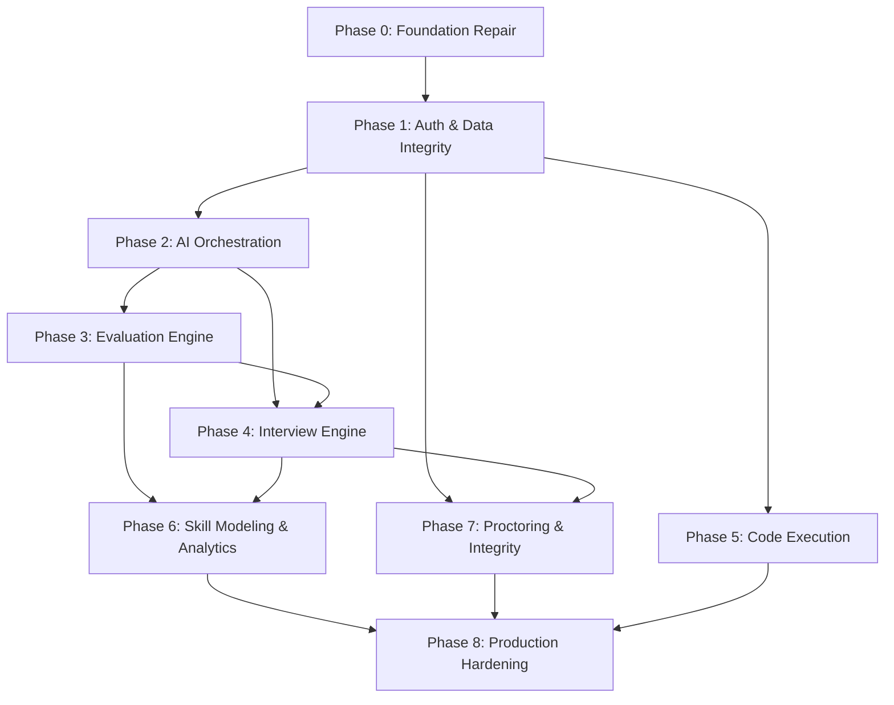

# Rebuild Plan — Interview Intelligence Platform

> **Generated:** 2026-09-30  
> **Target:** AIML-focused interview intelligence platform with measurable intelligence, real persisted data, structured AI outputs, adaptive interviewing, candidate skill modeling, longitudinal analytics, explainable assessment, reliable backend orchestration, and production-quality engineering.

---

## Target Architecture

```
┌──────────────────────────────────────────────────────────────────────────┐
│                          CLIENT (Next.js 15)                            │
│  ┌──────────┐ ┌───────────┐ ┌──────────┐ ┌───────────┐ ┌───────────┐  │
│  │ Interview │ │ Dashboard │ │   IDE    │ │ Analytics │ │  Practice │  │
│  │  Session  │ │           │ │ + Runner │ │           │ │   Mode    │  │
│  └─────┬─────┘ └─────┬─────┘ └────┬─────┘ └─────┬─────┘ └─────┬─────┘  │
│        │              │            │              │              │       │
│  ┌─────▼──────────────▼────────────▼──────────────▼──────────────▼────┐  │
│  │                    Supabase Auth (JWT)                             │  │
│  │              Next.js Middleware → Token Forward                    │  │
│  └───────────────────────────┬───────────────────────────────────────┘  │
└──────────────────────────────┼──────────────────────────────────────────┘
                               │ Authenticated API calls
                               ▼
┌──────────────────────────────────────────────────────────────────────────┐
│                     BACKEND (FastAPI / Python)                          │
│                                                                         │
│  ┌─────────────────────────────────────────────────────────────────┐    │
│  │  Auth Middleware: JWT validation, user extraction, rate limit   │    │
│  └──────────┬──────────────────────────────────────────────────────┘    │
│             │                                                           │
│  ┌──────────▼──────────┐  ┌──────────────────────┐                     │
│  │  Interview Engine   │  │  AI Orchestrator     │                     │
│  │  - Session FSM      │  │  - Prompt templates  │                     │
│  │  - Question queue   │  │  - JSON schema mode  │                     │
│  │  - Adaptive logic   │  │  - Structured output │                     │
│  │  - Timer mgmt       │  │  - Retry/fallback    │                     │
│  │  - Score aggregator │  │  - Cost tracking     │                     │
│  └──────────┬──────────┘  └──────────┬───────────┘                     │
│             │                        │                                  │
│  ┌──────────▼──────────┐  ┌──────────▼───────────┐                     │
│  │  Evaluation Engine  │  │  Skill Modeler       │                     │
│  │  - Rubric-based     │  │  - Competency graph  │                     │
│  │  - Multi-dimensional│  │  - Bayesian updates  │                     │
│  │  - AI + deterministic│ │  - Longitudinal track│                     │
│  │  - Explainability   │  │  - Strength/weakness │                     │
│  └──────────┬──────────┘  └──────────┬───────────┘                     │
│             │                        │                                  │
│  ┌──────────▼──────────┐  ┌──────────▼───────────┐                     │
│  │  Code Execution     │  │  Proctoring Engine   │                     │
│  │  - Sandboxed Docker │  │  - Signal fusion     │                     │
│  │  - Test case runner │  │  - Evidence-based    │                     │
│  │  - Timeout/memory   │  │  - Confidence scores │                     │
│  │  - Multi-language   │  │  - Audit trail       │                     │
│  └──────────┬──────────┘  └──────────┬───────────┘                     │
│             │                        │                                  │
│  ┌──────────▼────────────────────────▼───────────────────────────┐     │
│  │              Data Access Layer (Pydantic + Supabase)          │     │
│  │              - Type-safe models  - Migrations                 │     │
│  │              - Repository pattern - Connection pooling        │     │
│  └───────────────────────────┬───────────────────────────────────┘     │
└──────────────────────────────┼──────────────────────────────────────────┘
                               │
                               ▼
┌──────────────────────────────────────────────────────────────────────────┐
│                    SUPABASE / POSTGRESQL                                 │
│                                                                         │
│  ┌────────────────┐ ┌────────────────┐ ┌────────────────┐              │
│  │  Users +       │ │  Interviews    │ │  Analytics     │              │
│  │  Profiles      │ │  + Questions   │ │  + Skill Model │              │
│  │  + Preferences │ │  + Evaluations │ │  + Events      │              │
│  └────────────────┘ └────────────────┘ └────────────────┘              │
│                                                                         │
│  RLS: Enforced via service_role key with proper user_id validation     │
│  Migrations: Versioned via Supabase CLI or Alembic                     │
└──────────────────────────────────────────────────────────────────────────┘
```

---

## Core Design Principles

### 1. Measurable Intelligence
- Every score has a defined rubric with labeled criteria
- AI scores are validated against rubric bounds and cross-checked for consistency
- Deterministic components (test case pass/fail, code complexity metrics) complement AI assessment
- Score history enables statistical confidence intervals

### 2. Real Persisted Data
- Zero hardcoded mock data in any user-facing component
- Every interaction creates a database record
- Session replay capability from persisted event log
- All AI model inputs and outputs logged for auditability

### 3. Structured AI Outputs
- All Gemini calls use JSON mode or function calling
- Pydantic models define expected response schemas
- Schema validation on every AI response with graceful degradation
- Clear separation: AI provides raw signal → backend applies scoring rules

### 4. Adaptive Interviewing
- Question selection considers: prior scores, identified weak areas, question diversity
- Difficulty adjusts based on running performance (Item Response Theory-inspired)
- Follow-up questions are contextual, using full session history
- Interview blueprint defines coverage targets per competency area

### 5. Candidate Skill Modeling
- Competency graph with nodes for each skill area
- Bayesian skill estimates updated per evaluation
- Confidence intervals narrow with more data points
- Cross-session skill tracking with decay for recency

### 6. Longitudinal Analytics
- All dashboards powered by real queries against persisted data
- Time-series performance tracking per user
- Cohort comparison (anonymized)
- Exportable reports with methodology explanation

### 7. Explainable Assessment
- Every score includes a human-readable justification
- Rubric criteria mapped to specific answer elements
- AI reasoning chain preserved and displayable
- "Why this score?" tooltip on every metric

### 8. Reliable Backend Orchestration
- FastAPI with async support for concurrent AI calls
- Finite state machine for interview session lifecycle
- Idempotent operations with deduplication
- Circuit breakers for external service calls (Gemini, code execution)
- Health checks with dependency status

### 9. Production-Quality Engineering
- Typed throughout (Pydantic backend, TypeScript frontend)
- CI/CD with lint, test, build gates
- Containerized deployment
- Structured logging with correlation IDs
- Monitoring and alerting

---

## Implementation Phases

### Phase 0: Foundation Repair (Week 1-2)
**Goal:** Fix critical bugs and security issues without redesigning.

**Dependencies:** None

| Task | Priority | Effort |
|------|----------|--------|
| Fix TD-BUG-01: `evaluate_code()` argument order | 🔴 | 1h |
| Fix TD-BUG-05: Implement or remove `security/report` | 🔴 | 2h |
| Fix TD-BUG-02: `generate_coding_question()` args | 🟠 | 1h |
| Fix TD-BUG-03: `generate_follow_up_question()` type | 🟠 | 1h |
| Fix TD-BUG-04: `security/check` missing key | 🟠 | 1h |
| Fix TD-SEC-05: Remove `debug=True` | 🟠 | 15min |
| Fix TD-DATA-02: Question text storage | 🟠 | 2h |
| Fix TD-ARCH-02: Wire frontend session creation to backend | 🟠 | 3h |
| Fix TD-SEC-04: Fail on missing SECRET_KEY | 🟠 | 30min |
| Clean: Remove stale deps from package.json | 🟡 | 30min |
| Clean: Regenerate pnpm lockfile | 🟡 | 15min |
| Clean: Remove duplicate migration files | 🟡 | 1h |
| Clean: Remove dead code (deploy.py, debug_db.py, unused components) | 🟡 | 2h |

**Deliverable:** A codebase where existing features actually work end-to-end without runtime errors.

---

### Phase 1: Auth & Data Integrity (Week 2-3)
**Goal:** Establish authenticated data flow from frontend through backend to database.

**Dependencies:** Phase 0

| Task | Priority | Effort |
|------|----------|--------|
| Implement JWT validation middleware in Flask | 🔴 | 4h |
| Forward Supabase auth token from frontend to Flask | 🔴 | 3h |
| Use Supabase service_role key in backend with validated user_id | 🔴 | 3h |
| Verify RLS policies work with new auth flow | 🔴 | 2h |
| Add Pydantic request/response models for all endpoints | 🟠 | 6h |
| Add input validation and sanitization | 🟠 | 4h |
| Implement proper error response format | 🟡 | 3h |
| Add CORS strict origin validation | 🟡 | 1h |
| Consolidate database schema into single versioned migration | 🟡 | 3h |

**Deliverable:** Authenticated end-to-end data flow with type-safe data models.

---

### Phase 2: AI Orchestration (Week 3-5)
**Goal:** Reliable, structured, auditable AI integration.

**Dependencies:** Phase 1

| Task | Priority | Effort |
|------|----------|--------|
| Implement Gemini JSON mode / function calling for structured output | 🔴 | 6h |
| Define Pydantic schemas for all AI response types | 🔴 | 4h |
| Add response validation with retry on invalid output | 🟠 | 4h |
| Eliminate silent fallbacks — use explicit error responses | 🟠 | 3h |
| Consolidate to single AI pathway (remove frontend /api/ai routes) | 🟠 | 4h |
| Implement prompt template system with versioning | 🟠 | 4h |
| Add prompt injection protections | 🟠 | 3h |
| Add token counting and cost tracking | 🟡 | 4h |
| Add AI call logging (input/output/latency/tokens) | 🟡 | 3h |
| Implement circuit breaker for Gemini API | 🟡 | 3h |

**Deliverable:** A single AI orchestration layer with structured outputs, validation, and auditability.

---

### Phase 3: Evaluation Engine (Week 5-7)
**Goal:** Meaningful, explainable, consistent scoring.

**Dependencies:** Phase 2

| Task | Priority | Effort |
|------|----------|--------|
| Define scoring rubrics per interview type and difficulty | 🔴 | 8h |
| Implement multi-dimensional evaluation schema | 🔴 | 6h |
| Fix score aggregation (proper running average) | 🔴 | 2h |
| Add rubric-criterion mapping in AI prompts | 🟠 | 4h |
| Implement deterministic scoring components (code metrics, test results) | 🟠 | 6h |
| Add score validation bounds and consistency checks | 🟠 | 3h |
| Implement "explain this score" with rubric reference | 🟡 | 4h |
| Add evaluation history with diff tracking | 🟡 | 3h |

**Deliverable:** An evaluation system with defined rubrics, explainable scores, and mathematical correctness.

---

### Phase 4: Interview Engine (Week 6-8)
**Goal:** Orchestrated interview sessions with adaptive question selection.

**Dependencies:** Phase 2, Phase 3

| Task | Priority | Effort |
|------|----------|--------|
| Implement session FSM (created → started → active → completing → completed) | 🔴 | 6h |
| Build question queue with coverage targets | 🔴 | 6h |
| Implement adaptive difficulty selection based on running performance | 🟠 | 6h |
| Build contextual follow-up question generation using session history | 🟠 | 4h |
| Implement interview blueprint (question distribution per competency) | 🟠 | 4h |
| Add session persistence and resume capability | 🟡 | 4h |
| Implement server-side timer with grace periods | 🟡 | 3h |
| Add question de-duplication across sessions | 🟡 | 3h |

**Deliverable:** A stateful interview engine that adapts to candidate performance and ensures competency coverage.

---

### Phase 5: Real Code Execution (Week 7-9)
**Goal:** Sandboxed, real code execution with test case validation.

**Dependencies:** Phase 1

| Task | Priority | Effort |
|------|----------|--------|
| Set up sandboxed execution service (Judge0 or Docker-based) | 🔴 | 8h |
| Implement multi-language execution (Python, JS, Java, C++ minimum) | 🔴 | 4h |
| Build test case definition and execution framework | 🟠 | 6h |
| Add execution timeout, memory limits, and security constraints | 🟠 | 4h |
| Connect code evaluation to both execution results AND AI analysis | 🟠 | 4h |
| Add code metrics (cyclomatic complexity, LOC, etc.) | 🟡 | 3h |
| Replace frontend fake execution with real results | 🟡 | 3h |

**Deliverable:** Real code execution in a secure sandbox with test case validation, complementing AI-based code analysis.

---

### Phase 6: Skill Modeling & Analytics (Week 8-10)
**Goal:** Persistent, queryable analytics based on real data.

**Dependencies:** Phase 3, Phase 4

| Task | Priority | Effort |
|------|----------|--------|
| Design and implement competency graph schema | 🔴 | 6h |
| Implement skill estimate updates from evaluation data | 🔴 | 4h |
| Build real dashboard queries replacing mock data | 🔴 | 6h |
| Build real analytics charts from persistent data | 🟠 | 6h |
| Implement longitudinal tracking with time-series queries | 🟠 | 4h |
| Add confidence intervals on skill estimates | 🟡 | 4h |
| Build improvement recommendation engine | 🟡 | 4h |
| Implement report export (PDF/CSV) | 🟡 | 4h |

**Deliverable:** A real analytics system powered by actual evaluation data, with skill modeling and longitudinal tracking.

---

### Phase 7: Proctoring & Integrity (Week 9-11)
**Goal:** Evidence-based, auditable integrity monitoring.

**Dependencies:** Phase 1, Phase 4

| Task | Priority | Effort |
|------|----------|--------|
| Redesign anti-cheat as evidence collection (not accusation) system | 🔴 | 4h |
| Implement server-side signal fusion from client events | 🟠 | 4h |
| Add confidence scores to integrity assessments | 🟠 | 3h |
| Build audit trail for all integrity signals | 🟠 | 3h |
| Implement browser event persistence to backend | 🟡 | 3h |
| Add anomaly detection on answer timing and patterns | 🟡 | 4h |
| Remove unsubstantiated claims from UI (face detection, gaze, audio) | 🟡 | 2h |

**Deliverable:** An integrity monitoring system that collects evidence, assigns confidence, and maintains an audit trail.

---

### Phase 8: Production Hardening (Week 10-12)
**Goal:** Production-ready deployment and operations.

**Dependencies:** All prior phases

| Task | Priority | Effort |
|------|----------|--------|
| Create Dockerfile for backend | 🔴 | 3h |
| Set up CI/CD (GitHub Actions: lint, test, build, deploy) | 🔴 | 4h |
| Implement structured JSON logging | 🟠 | 3h |
| Add request correlation IDs | 🟠 | 2h |
| Set up monitoring/alerting (health, latency, error rate) | 🟠 | 4h |
| Pin all dependencies with lockfiles | 🟠 | 2h |
| Add integration tests for critical paths | 🟠 | 8h |
| Add E2E tests for primary user flows | 🟡 | 6h |
| Performance profiling and optimization | 🟡 | 4h |
| Security audit and penetration test checklist | 🟡 | 4h |

**Deliverable:** A deployable, monitored, tested production system.

---

## Phase Dependency Graph



## Estimated Timeline

| Phase | Weeks | Can Parallelize With |
|-------|-------|---------------------|
| Phase 0: Foundation Repair | 1-2 | — |
| Phase 1: Auth & Data Integrity | 2-3 | — |
| Phase 2: AI Orchestration | 3-5 | Phase 5 |
| Phase 3: Evaluation Engine | 5-7 | Phase 5 |
| Phase 4: Interview Engine | 6-8 | Phase 5, Phase 7 |
| Phase 5: Code Execution | 3-5 | Phase 2, 3, 4 |
| Phase 6: Skill Modeling | 8-10 | Phase 7 |
| Phase 7: Proctoring | 9-11 | Phase 6 |
| Phase 8: Production Hardening | 10-12 | — |

**Total estimated duration: 10-12 weeks** (with parallelization of independent tracks)

---

## Migration vs Rewrite Decision

**Recommendation: Incremental migration, not rewrite.**

Rationale:
1. The Flask/Next.js/Supabase stack is appropriate for this application.
2. The core structure (routes, services, components) is sound — the problems are in implementation quality, not architecture.
3. Most fixes are surgical: argument order, auth middleware, data wiring.
4. The shadcn/ui component library and Monaco editor integration are reusable.
5. A rewrite would lose the existing structure without proportional benefit.

The plan above rebuilds every mocked/broken capability while preserving working code (shadcn components, Supabase client setup, Monaco integration, basic route structure).

---

## Key Technical Decisions for Target Architecture

| Decision | Choice | Rationale |
|----------|--------|-----------|
| Backend framework | Keep Flask or migrate to FastAPI | FastAPI preferred for async AI calls, auto-docs, Pydantic native. Flask works if team prefers. |
| AI SDK | Single pathway via backend | Eliminates dual-model confusion, enables prompt management and cost control |
| AI structured output | Gemini JSON mode + Pydantic validation | Eliminates fragile regex JSON extraction |
| Code execution | Judge0 API or custom Docker runner | Real sandboxed execution with timeout/memory controls |
| Database migrations | Supabase CLI migrations or Alembic | Versioned, trackable, reversible |
| Skill modeling | Custom Bayesian estimator | Simple enough to implement, provides confidence intervals |
| Monitoring | Structured logs + health endpoints | Minimal viable observability |
